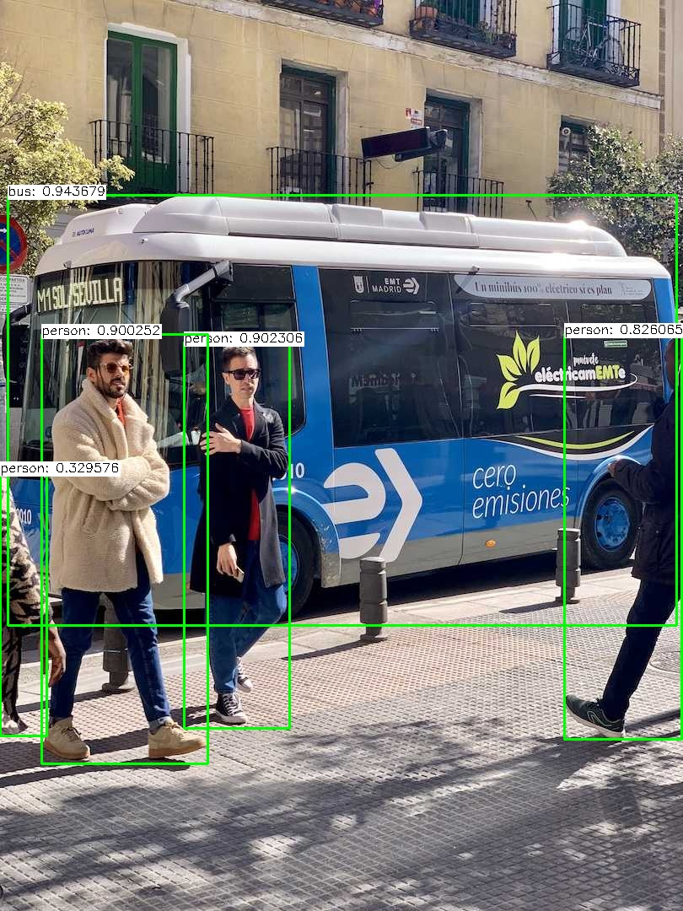
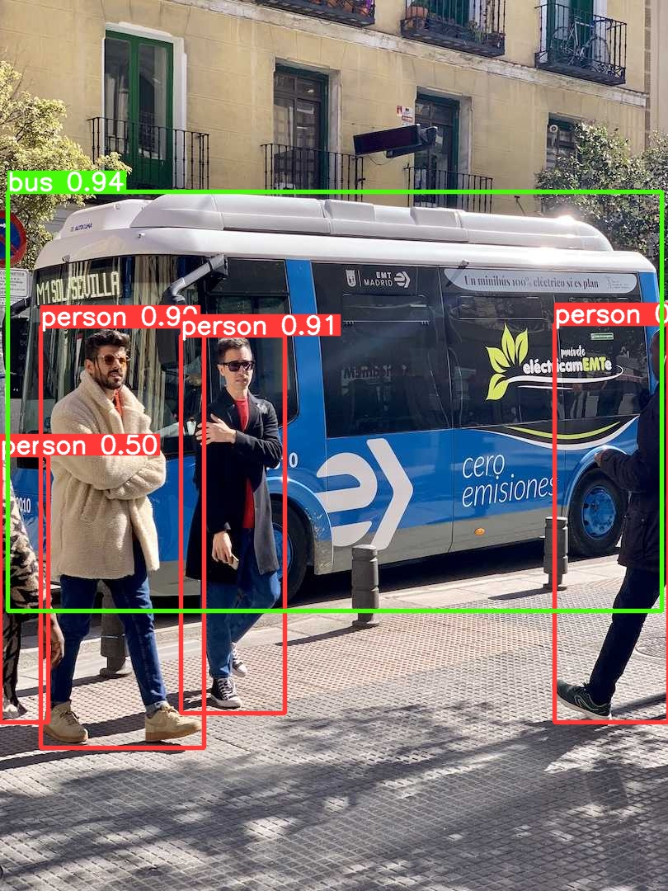
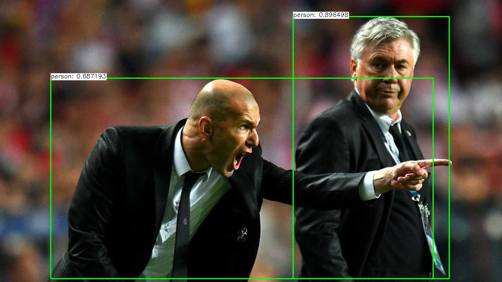
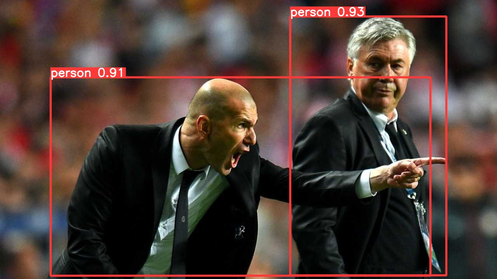

<h1 align="center">Yolo V10 cpp</h1>

<h3 align="center"> Jose Sarmiento | josedanielsarmiento219@gmail.com</h3>


## Resumen

The next repository aims to provide a basic c++ script using std 17 over, to do it and consider the speed The code use OpenCv 4.9.0_8 and Onnx 1.17.1 to manipulate the image and inference the model. Note that Opncv don't support a native integration because yolov10 integra A top K layer in their architecture.


## Prepare the code 


1. Download de model you want 

  
  - yolov10n
  - yolov10s
  - yolov10m
  - yolov10b
  - yolov10l
  - yolov10x


```bash
    python download_model.py  --model {MODEL_SELECTED}
```

## Install packages

```
    conda create -n yolov10 python=3.9
    conda activate yolov10

    git clone https://github.com/THU-MIG/yolov10
    cd yolov10

    pip install -r requirements.txt
    pip install -e .

    cd ..
```

## Convert model

```
    yolo export model=yolov10n.pt format=onnx
```
## Dependencies 

1. ffmpeg
2. Opnecv
3. onnxruntime


- MacOs
```
    brew install ffmpeg 
    brew install opencv
    brew install onnxruntime
```

- Ubuntu: Unfortunately, onnx runtime is no available using native apt-get

You can use python
```
sudo apt-get update
sudo apt-get install python3-pip
pip3 install onnxruntime
```

dotnet 
```
dotnet add package Microsoft.ML.OnnxRuntime

```


## How to run this code 


1. Using Cmake, Recommended

```
    mkdir build
    cd build
    cmake ..
    make
```


2. Run the following command 

> static images

```
    ./yolov10_cpp [MODEL_PATH] [IMAGE_PATH]
```

> realtime 

```
    ./yolov10_cpp_video [MODEL_PATH] [SOURCE]
```

## Results 

our cpp binding | python binding

<p align="center">
  
  
</p>

<p align="center">
  
  
</p>

> source = Apple M3 PRO

| Command Line Execution                                              | Resource Utilization                                 |
|---------------------------------------------------------------------|------------------------------------------------------|
| `./yolov10_cpp ../yolov10n.onnx ../bus.jpg`                         | **0.46s** user, **0.10s** system, **94%** CPU, **0.595s** total |
| `yolo detect predict model=yolov10n.onnx source=bus.jpg`            | **1.69s** user, **2.44s** system, **291%** CPU, **1.413s** total |


## Future plans

1. Modularize the components. ✅
2. Make a example to video real time. ✅
3. Support Cuda. ?

## Inspiration

[Ultraopxt](https://github.com/Ultraopxt/yolov10cpp)


## Reference 

[1] Wang, A., Chen, H., Liu, L., Chen, K., Lin, Z., Han, J., & Ding, G. (2024). YOLOv10: Real-Time End-to-End Object Detection. arXiv [Cs.CV]. Retrieved from http://arxiv.org/abs/2405.14458